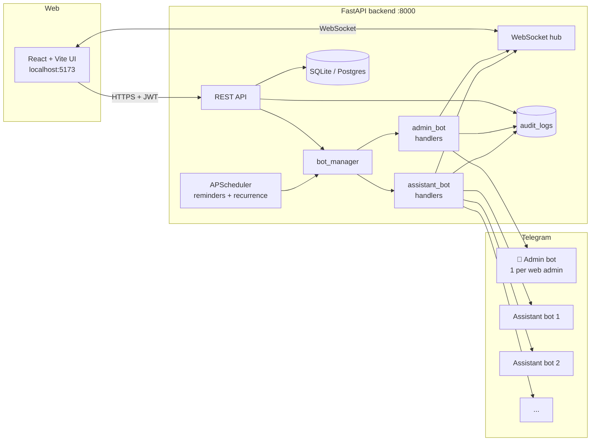

# Khant Assistance v2 — Dual-Bot Personal Assistance

Real-time job dispatching for a personal-assistant team, controllable from both a web dashboard
**and** the admin's own Telegram bot. Each assistant has their own bot; the admin has a separate
*remote-control* bot that can create/reassign/cancel jobs, broadcast announcements, and pause the
whole fleet — without ever touching destructive operations like deleting another web admin.

## Architecture



## Quickstart

### macOS / Linux
```bash
./start.sh
```

### Windows
```bat
start.bat
```

The launcher creates the Python venv, installs deps, and starts both servers.

- Web UI → <http://localhost:5173>
- API → <http://localhost:8000> (Swagger at `/docs`)
- Default login: `khantphyo.myanmar@gmail.com` / `Cisco@123`

See [INSTALL.md](INSTALL.md) for per-OS prerequisites.

## Roles

| Tier | Who | Where | Capabilities |
|------|-----|-------|--------------|
| 1 | **Web Admin** | Web UI | Full CRUD on assistants/jobs/groups/admins, reads audit log, binds bots |
| 2 | **Admin Bot** | Telegram | `/newjob /jobs /assistants /broadcast /stats /report /reassign /cancel /reminder /pause /resume` — refuses destructive verbs |
| 3 | **Assistant Bot** | Telegram | Inline Accept/Decline/Transfer · `/finished JOB-xxxx` with attachment of the right type · `/jobs /pending` |

## Admin bot command map

```text
/newjob TITLE | DESC | YYYY-MM-DD HH:MM | @username
/createjob              # multi-step alternative
/jobs [done|pending|overdue]
/assistants
/broadcast <message>
/stats [today|week|month]
/report JOB-xxxx        # fetches latest report file/text
/reassign JOB-xxxx @username
/cancel JOB-xxxx
/reminder JOB-xxxx <minutes>
/pause | /resume        # freeze/unfreeze the whole fleet
```

`delete_admin`, `remove_admin`, `drop_db`, `rotate_secret`, `wipe_uploads` are server-side blocked
in `backend/app/services/admin_bot.py:BLOCKED_COMMANDS`. Every refusal writes an audit row.

## Anti-hijack pairing

Each admin bot has an `owner_user_id`. On `/start`, the bot verifies that
`update.effective_user.username` matches `users.telegram_username` of the owner — if not, pairing
is refused. Once paired, every subsequent message must come from the same `chat_id`.

## Security

- Passwords: **bcrypt** (cost 12 default).
- Sessions: **JWT HS256**, 12h expiry.
- Bot tokens: **Fernet** ciphertext at rest (`backend/data/.fernet_key`, autogenerated).
- Rate limit: **30 cmd / 60 s** per Telegram chat (`services/rate_limit.py`).
- Audit: every web POST/PATCH/DELETE and bot command writes a row (`services/audit.py`).
- CORS: restricted to `FRONTEND_ORIGIN` env.
- Uploads: outside web root, served via authenticated `/api/jobs/{id}/reports/{rid}/download`.

## Tech

| Layer | Stack |
|---|---|
| Backend | Python 3.11+ · FastAPI 0.115 · SQLAlchemy 2 · python-telegram-bot 21 · APScheduler |
| Frontend | React 18 + TS · Vite 5 · Tailwind 3 (dark default, accent `#6366f1`) · React Query 5 · Recharts |
| Auth | JWT HS256 12h + bcrypt |
| Secrets | Fernet (cryptography) |
| Storage | SQLite (dev) / Postgres (prod via `docker-compose.yml`) |

## Project layout

```
KhantAssistanceV2/
├── backend/
│   ├── requirements.txt
│   ├── .env.example
│   └── app/
│       ├── main.py            # lifespan: create_all → seed → boot bots → start scheduler
│       ├── config.py          # Fernet auto-gen + persisted .fernet_key
│       ├── db.py · security.py
│       ├── models/            # User, Bot, Assistant, Job, Group, Setting, Announcement, AuditLog
│       ├── schemas/           # pydantic
│       ├── routers/           # auth, admins, admin_bots, assistants, jobs, groups,
│       │                      # dashboard, control, audit, announcements, ws
│       └── services/
│           ├── bot_manager.py # multi-app orchestrator, dispatched on bot_type
│           ├── admin_bot.py   # v2 command set, anti-hijack guard, allowlist
│           ├── assistant_bot.py
│           ├── reminders.py   # APScheduler: deadlines, overdue, recurrence, ad-hoc one-shots
│           ├── ws_hub.py
│           ├── audit.py
│           └── rate_limit.py
└── frontend/
    └── src/
        ├── App.tsx
        ├── api/client.ts
        ├── contexts/AuthContext.tsx
        ├── hooks/useWebSocket.ts
        ├── components/        # StatLED, AssistantBadge
        └── pages/             # Login, Dashboard, Jobs, JobDetail, Assistants, Groups,
                               # ControlPanel (4 tabs), Admins, AuditLog
```

## Development workflow

1. Edit a backend file → uvicorn `--reload` picks it up.
2. Edit a frontend file → Vite HMR.
3. SQLite DB at `backend/data/app.db` (delete to reset; `.fernet_key` lives next to it).
4. Bot tokens in DB are encrypted; deleting `.fernet_key` invalidates them — re-bind via UI.

## Acceptance tests

See the [INSTALL.md](INSTALL.md) "Verification" section for the 14-step manual checklist.

## License

Internal project — all rights reserved.
